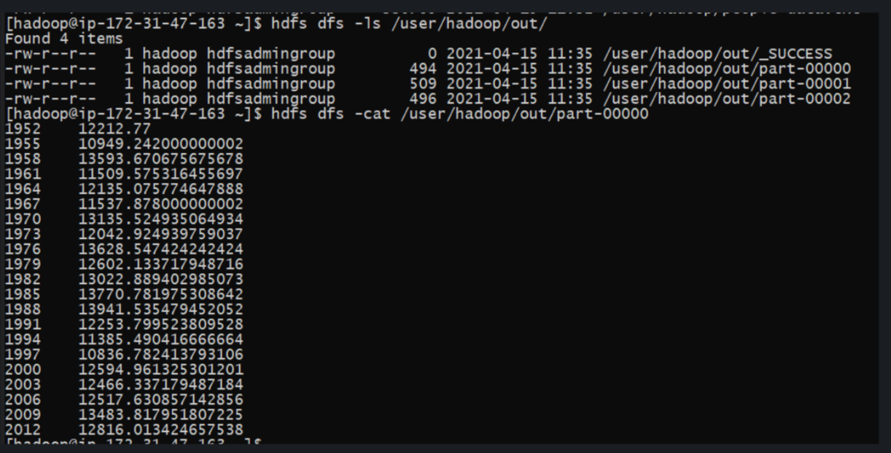

# AWS Hadoop MapReduce

## Tech stac

- AWS EMR cluster (EC2 machines, Hadoop, HDFS as storage)
- Linux (on WSL2) terminal for SSH, HDFS management and administration
- Python3 as scripting language

## Goal

Goal of this small project is to:
1. build infrastructure on AWS cloud (manual, not using AWS CLI)
2. prepare python scripts for mapper and reducer
3. parse input example file to EMR cluster
4.run scripts and check output  

Task to complete:   Consume .txt file with randomly generated data, see example: 
1971/10/09,M,Zachery,Mounter,zmounter9@cnbc.com,Poland,Ford,$8635.19 
and expose year and average amount. Use MapReduce paradigm for this purpose.

### AWS
For this part I decided to use AWS Console web gui. Main setup of EMR cluster would be 1 master node and 2 workers.  
Master: m4.large (1 instance) 
Workers: m4.large (2 instances)  
Additional notes: 
- On EC2 I've imported previously setup key
- In securities options I've redirect all trafic to (SSH) and from (UI for HDFS Name Node to double check files)

### Python scripts

1. Mapper.py 
Mapper consumes .txt file and slice line by line to get appropriate data. Output from mapper is string of key - value (year - amount) pair with additional constant counter = 1.
   
2. Reducer.py 
Reducer consumes mapper output and slice it into pieces. Then variables are correctly casted and processed. Logic is to aggregate all the same keys by amount and counter and when different key enters then previous key average value is calculated and print. 

### Linux commands selection

- access to EMR: `ssh -i ~/password.pem hadoop@ec2-xx-xxx-xxx-xx.eu-central-1.compute.amazonaws.com`
- secure copy files to EMR machine `scp -C -i ./pw.ambari.study.pem -r ./mapper.py hadoop@ec2-xx-xxx-xxx-xx.eu-central-1.compute.amazonaws.com:~/mapper.py`
- import .txt from EMR main catalog to HDFS file system `hdfs dfs -copyFromLocal people-data.txt /user/hadoop`
- process file `hadoop-streaming -input /user/hadoop/people-data.txt -output /user/hadoop/out -mapper ./mapper.py -reducer ./reducer.py -file ./mapper.py ./reducer.py `
- Note: if Win IDE was used then probably we need to change EOL for unix ones, it can be done in vi by ':set ff=unix'

### Final result from EMR

- file was processed and saved to hdfs without errors
- sample output shows correctly aggregated values

